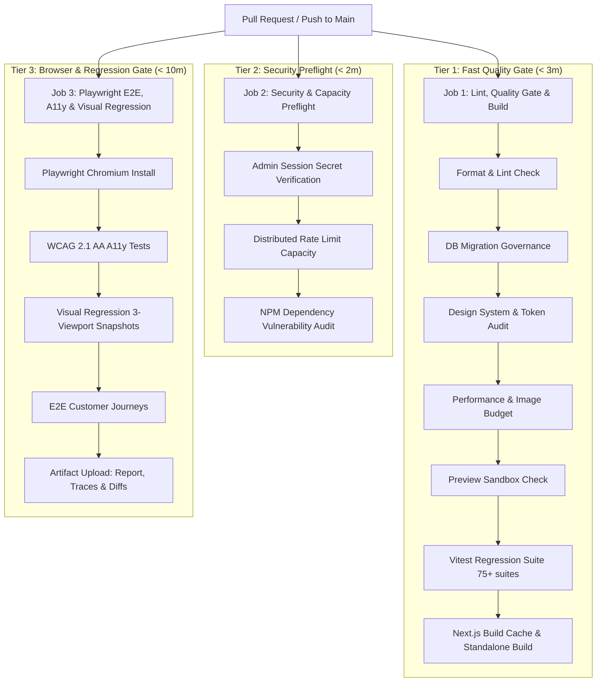

# Pexpacks Release Engineering & CI/CD Pipeline Guide

This document establishes the Continuous Integration (CI), automated testing tiers, caching architecture, failure diagnostics, and release governance standards across the Pexpacks platform.

---

## 1. CI/CD Pipeline Hierarchy

The platform CI workflow (`.github/workflows/ci.yml`) runs on all pushes and pull requests targeting the `main` branch. It executes three parallel and sequential job tiers:



---

## 2. Fast Quality Gate (Tier 1)

Runs immediately on pull requests to give rapid developer feedback:
1. **Formatting & Static Analysis**: `prettier --check` and `eslint` + `tsc --noEmit`.
2. **Database Migration Governance**: Enforces monotonic zero-drift numbering (`^\d{5}_[a-z0-9_]+\.sql$`).
3. **Design System Governance**: Token collision and legacy color audit (`npm run audit:design`).
4. **Performance & Asset Budget**: Image weight limits (<300KB file / <3072KB folder) and caching policies (`npm run audit:perf`).
5. **Preview Sandbox Verification**: Enforces `X-Robots-Tag: noindex, nofollow` and `assertNonProduction` guards (`npm run check:preview`).
6. **Domain Logic Regression**: 75+ test suites, 360+ tests passing in Vitest (`npm test`).
7. **Next.js Standalone Build**: Validates compilation with `.next/cache` restoration.

---

## 3. Browser, A11y & Visual Regression Gate (Tier 2 & 3)

1. **Automated Accessibility Testing (`npm run test:a11y`)**:
   - Executes `@axe-core/playwright` across homepage, search, order dropzone, school catalogue, contact, and admin console.
   - Enforces 0 critical or serious WCAG 2.1 AA violations.
2. **Visual Regression Testing (`npm run test:visual`)**:
   - Executes 23 pixel-perfect snapshot assertions across Desktop (1280px), Tablet (768px), and Mobile (390px).
   - Verifies design system primitives and core views.
3. **Artifact Archiving**:
   - On completion or failure, the workflow archives `playwright-report/` and `test-results/` for 14 days using `actions/upload-artifact@v4`.

---

## 4. Caching & Performance Acceleration

To ensure CI runs execute in minimal time:
1. **NPM Dependency Cache**: `actions/setup-node@v4` with `cache: "npm"`.
2. **Next.js Build Cache**: `actions/cache@v4` caching `.next/cache` keyed on `package-lock.json` and TypeScript source file hashes.
3. **Concurrency Control**: Superseded commits automatically cancel in-flight workflow runs:
   ```yaml
   concurrency:
     group: ${{ github.workflow }}-${{ github.ref }}
     cancel-in-progress: true
   ```

---

## 5. Protected Branch Rules & Release Protocol

1. **Branch Protection**: Direct pushes to `main` are restricted.
2. **Required Status Checks**:
   - `Lint, Quality Gate & Build`
   - `Security & Capacity Preflight`
   - `Playwright E2E, A11y & Visual Regression`
3. **Deployment Integration**:
   - Merges to `main` automatically trigger production deployment on Vercel with zero-downtime rolling updates.
   - PR branches deploy to ephemeral Vercel Previews with `X-Robots-Tag: noindex, nofollow` headers and Supabase branch isolation.
