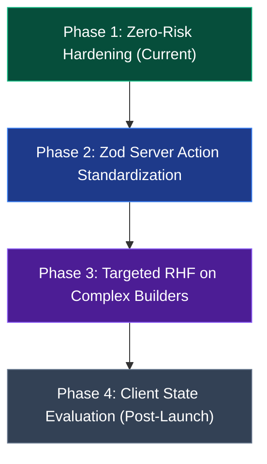

# Architecture Assessment & Technical Roadmap
## React Hook Form (RHF) • Zod Runtime Validation • TanStack Query

**Document:** `docs/ARCHITECTURE_ASSESSMENT_RHF_ZOD_QUERY.md`  
**Date:** September 2026  
**Status:** Architectural Guidance & Strategic Roadmap  
**Scope:** Pexpacks Platform Frontend, Admin Backoffice & Data Layers

---

## 1. Executive Summary

As part of the **Pexpacks Post-Tailwind Admin, Database & Platform Modernisation Master Programme**, this report evaluates the architectural fit, trade-offs, bundle implications, and implementation feasibility of three industry-standard patterns:

1. **React Hook Form (RHF)** vs. native React 19 `useActionState` + `FormData`.
2. **Zod Runtime Schema Validation** across Server Actions, API routes, and forms.
3. **TanStack Query (React Query v5)** vs. Next.js Server Components, Server Actions, and SWR.

### Strategic Directive
Per Section 24 of the Master Prompt, **this phase produces an assessment report only**. It does **NOT** execute unrequested rewrites of working forms, actions, or data loading mechanisms. Any future adoption must follow the phased, risk-weighted roadmap defined in Section 5.

---

## 2. Form Architecture: React Hook Form vs. React 19 `useActionState`

### 2.1 Current State in Pexpacks
The Pexpacks application currently operates on Next.js 16 and React 19. Forms across the administrative backoffice (e.g. `BlogForm`, `WebsiteContentForm`, `AssetUploadForm`, `SystemInfoVaultTab`) and public customer flows (`/order`, `/contact`) rely primarily on:
- **Native React 19 `useActionState`**: Server Actions bound to forms via `action={formAction}`.
- **`useFormStatus`**: Submit buttons tracking `pending` state natively without local useState toggles.
- **Native `FormData`**: Progressive enhancement capable, unopinionated key-value submission.

### 2.2 Comparison & Trade-Off Matrix

| Dimension | React 19 Native (`useActionState` + FormData) | React Hook Form (RHF) |
| :--- | :--- | :--- |
| **Client Bundle Impact** | **0 kB** (built into React 19 runtime). | **~8.5 kB** minified + gzipped. |
| **Progressive Enhancement** | **Native**. Works with standard browser form submission. | Requires JavaScript hydration to attach event handlers. |
| **Client-side Instant Validation** | Manual via state, or HTML5 native constraint API. | **Superior**. Real-time field-level re-renders, touched/dirty tracking. |
| **Complex Dynamic Field Arrays** | Manual state tracking required (e.g. `ContentBlocks.tsx`). | **First-class** with `useFieldArray`. |
| **Server Action Integration** | Native drop-in with `formAction`. | Requires bridge (`handleSubmit(async (data) => action(data))`). |
| **Ref Forwarding & UI Primitives** | Simple `name` and `id` props on native inputs. | Requires `register` or `Controller` wrapper for custom selects. |

### 2.3 Verdict & Recommendations
- **Maintain React 19 `useActionState` for standard CRUD forms**: For flat, single-entity forms (e.g., `AssetUploadForm`, `AssetEditForm`, `TestimonialForm`, `FaqForm`, `WebsiteContentForm`), React 19's native hooks are lighter, zero-dependency, and fully sufficient.
- **Targeted RHF Adoption for Highly Dynamic Multi-Item Forms (Phase 2 Roadmap)**:
  - The **Quotation Builder** (`QuotationBuilderForm.tsx`) and **School Pack Item Builder** feature nested line items, dynamic quantity multipliers, inline product search pickers, and real-time client pricing recalculations.
  - In these specific domains, introducing React Hook Form with `@hookform/resolvers/zod` would reduce boilerplate and eliminate manual index-splicing code.

---

## 3. Runtime Validation: Zod Integration Strategy

### 3.1 Current State in Pexpacks
The repository already has `zod ^4.4.3` installed in `package.json` and utilizes schemas in select modules:
- AI draft cart payloads and list converter parser.
- Temporary password onboarding contracts.
- Distributed rate-limiting payload verification.
However, many legacy admin Server Actions still rely on ad-hoc string parsing (`formData.get("title") as string`) with manual validation checks.

### 3.2 Evaluation of Systematic Zod Adoption

```typescript
// Architectural Pattern for Pexpacks Server Actions:
import { z } from "zod";

export const MasterProductSchema = z.object({
  title: z.string().min(2, "Title must be at least 2 characters").max(180),
  sku: z.string().min(3).regex(/^[A-Z0-9_-]+$/, "SKU must be uppercase alphanumeric"),
  price_cents: z.number().int().nonnegative(),
  category: z.string().optional(),
  brand_id: z.string().uuid().nullable().optional(),
});

export type MasterProductInput = z.infer<typeof MasterProductSchema>;
```

### 3.3 Benefits for Pexpacks
1. **End-to-End Type Inference**: Eliminates dual maintenance of TypeScript interfaces and validation functions.
2. **Defensive API & Action Boundaries**: Guarantees sanitization before any database mutation reaches Supabase RPCs or queries.
3. **Structured Form Error Serialization**: Standardizes error envelopes returned by `useActionState`:
   ```typescript
   export type ActionState<T> = {
     ok: boolean;
     message?: string;
     errors?: Partial<Record<keyof T, string>>;
   };
   ```

### 3.4 Verdict & Recommendations
- **Adopt Zod across all Server Actions as the primary validation standard**:
  - Centralize domain schemas under `lib/schemas/` (e.g. `product.schema.ts`, `order.schema.ts`, `quotation.schema.ts`).
  - Use `schema.safeParse(Object.fromEntries(formData))` in server actions for clean, strongly-typed parsing without uncaught runtime exceptions.

---

## 4. Client Data Fetching: TanStack Query vs. SWR / Server Components

### 4.1 Current State in Pexpacks
Pexpacks follows modern Next.js App Router architecture:
- **Server-Side Data Rendering**: Root and admin pages load data in React Server Components (`page.tsx`) directly using Supabase server clients (`lib/supabase/server.ts`).
- **Client Cache**: `swr ^2.5.1` is installed and used for client-side search indexing and live status polling.
- **Mutations**: Triggered via Server Actions with `revalidatePath()` for server cache invalidation.

### 4.2 Comparison: TanStack Query v5 vs. SWR vs. Server Actions

| Feature | Next.js Server Components + Server Actions | SWR | TanStack Query v5 |
| :--- | :--- | :--- | :--- |
| **Primary Philosophy** | Server-first (RSC) + `revalidatePath` | Lightweight client fetching & polling | Enterprise client state, cache & mutations |
| **Bundle Size** | **0 kB** client runtime | **~4.2 kB** | **~13.1 kB** |
| **Optimistic Updates** | React 19 `useOptimistic` | `mutate(data, false)` | Comprehensive mutation lifecycle (`onMutate`) |
| **Query Cancellation** | Handled by fetch AbortSignal | Basic | Native `AbortController` query cancellation |
| **DevTools** | Browser Network tab | Third-party | Dedicated `@tanstack/react-query-devtools` |
| **Complexity & Setup** | None (standard Next.js) | Minimal `SWRConfig` | QueryClientProvider, hydration boundaries |

### 4.3 Verdict & Recommendations
- **Do NOT replace Server Components with TanStack Query**: The Next.js App Router server-first model provides excellent SEO, zero client bundle weight for initial page loads, and direct database access with zero API surface overhead.
- **Retain SWR for lightweight client polling**: For notifications, unread task counts, and real-time session heartbeats, SWR's 4 kB footprint is ideal.
- **Consider TanStack Query exclusively for Offline-First or Heavy Multi-Filter Desktop Tables**: If the backoffice transitions to a fully offline-capable progressive web application (PWA) with extensive client-side cache persistence (IndexedDB), TanStack Query v5 is the recommended tool.

---

## 5. Strategic Modernization Roadmap



### Phase 1: Zero-Risk Hardening (Completed in Current Programme)
- Native Tailwind design system tokens.
- TanStack Table v9 integration.
- Supabase generated type grounding (`Database["public"]["Tables"]["master_products"]["Row"]`).
- Automated multi-tier Quality Gate (`check:all`).

### Phase 2: Zod Server Action Standardization (Recommended Next Iteration)
- **Effort:** Low | **Risk:** Very Low | **ROI:** High
- Audit all `actions.ts` files under `app/admin/`.
- Replace manual `typeof` checks with `ZodSchema.safeParse()`.
- Unify form error return types.

### Phase 3: Targeted React Hook Form Adoption (Targeted)
- **Effort:** Medium | **Risk:** Low | **ROI:** Medium
- Migrate `QuotationBuilderForm.tsx` to `react-hook-form` + `useFieldArray`.
- Migrate pack item customization drawer to `react-hook-form`.
- Keep standard CRUD forms on React 19 `useActionState`.

### Phase 4: TanStack Query Evaluation (Long-Term / Post-Peak)
- **Effort:** High | **Risk:** Medium | **ROI:** Low (given Next.js 16 RSC maturity)
- Keep current RSC + Server Actions + SWR model unless dedicated offline backoffice requirements emerge.
